# AI Video Engine

Turn a plain-text narration script into a finished, narrated explainer video with
one command. No timeline, no manual editing, no per-script code.

```bash
./run --script scripts/script_a.txt --out output/script_a.mp4
```

That command segments the script, asks an LLM to *annotate* the segments it was
given, computes every on-screen number in Python, synthesises the voiceover,
aligns the visuals to the spoken words, renders the scenes and muxes one MP4 —
plus an `output/script_a.spec.json` you can open, edit, and re-render from.

---

## Table of contents

- [What this is](#what-this-is)
- [The core idea: a compiler, not a prompt](#the-core-idea-a-compiler-not-a-prompt)
- [Workflow](#workflow)
- [Setup](#setup)
- [Usage](#usage)
- [The dashboard](#the-dashboard)
- [Architecture](#architecture)
- [Tech stack](#tech-stack)
- [Configuration](#configuration)
- [Repository layout](#repository-layout)
- [Verification tools](#verification-tools)
- [Troubleshooting](#troubleshooting)

---

## What this is

A script-to-video **compiler**. You hand it prose; it hands back an MP4 in which:

- the narration is spoken by a TTS voice,
- each passage of the script becomes a scene with a layout chosen for its content,
- every number on screen was **computed by Python**, not written by a language model,
- elements appear on the **word** that introduces them, within ±150 ms,
- and the whole intermediate representation is a JSON file you can edit and re-render.

It is not a template filler and not a wrapper around a single model call. The LLM
does exactly one narrow job — described below — and cannot affect timing,
arithmetic, or scene boundaries.

---

## The core idea: a compiler, not a prompt

The obvious way to build this is "give the model the script, ask for a scene
plan." That fails in a specific, predictable way: the model authors numbers. Ask
for a video about 8-bit colour and it will happily write `16,777,216` into a
field — and occasionally write `16,777,215`. Nothing downstream can tell the
difference, because a wrong number and a right number are both strings.

So the responsibilities are split, and the split is enforced by types:

| Stage | Who does it | Why |
|---|---|---|
| Split the script into scenes | **Python**, deterministically | Boundaries must be reproducible; a model reshuffles them run to run |
| Decide what each scene *shows* | **The LLM** | A judgement call about language — the one thing it is actually good at |
| Compute the values shown | **Python**, via a whitelisted AST evaluator | Arithmetic must be right, not plausible |
| Decide when things appear | **The TTS engine's own word timings** | Exact by construction; no guessing, no forced-alignment model |
| Draw the frames | **Remotion / React** | Pure functions of the frame number |

The LLM receives segments it cannot change and returns, per segment, a template
name plus *expressions* like `256**3` — never results. `evaluator.py` computes
`16,777,216` from that expression and stores both. Templates render the
`resolved` field and are structurally incapable of computing anything.

The consequence: **the LLM never computes, never rewrites narration, never
chooses scene boundaries, and never emits code.**

---

## Workflow

The full pipeline. Every stage boundary is also a cache boundary, which is what
makes incremental re-rendering work: edit one scene's expression and only that
scene's frames are re-rendered.

```mermaid
flowchart TD
    A["narration script<br/><i>plain .txt</i>"] --> B

    subgraph DET["Deterministic Python — no model involved"]
        B["<b>1. Segment</b><br/>normalise, split sentences,<br/>group to ~12 s targets"]
        B --> BF{{"assert_fidelity:<br/>concatenated narration<br/>== input script"}}
    end

    BF --> C

    subgraph LLM["The LLM's only job"]
        C["<b>2. Annotate</b><br/>per fixed segment, choose a<br/>template + labels + expressions<br/><i>expr: 256**3 — never a result</i>"]
        C --> CR["reconcile:<br/>repair counts, unknown templates,<br/>unmatched cue words"]
    end

    CR --> D

    subgraph PY["Python owns every value and every timing"]
        D["<b>3. Evaluate</b><br/>whitelisted AST walk,<br/>never eval&#40;&#41;<br/><i>256**3 → 16,777,216</i>"]
        D --> E["<b>3.5 Assets</b><br/>rarest narration keyword<br/>→ vendored icon"]
        E --> F["<b>4. Speak + align</b><br/>TTS per scene → PCM<br/>+ word boundaries → word triggers"]
        F --> G["<b>5. Audio track</b><br/>one PCM buffer; each scene's<br/>length ceil-quantised to whole frames"]
    end

    G --> H["<b>6. Render</b><br/>Remotion renders each scene<br/>to a silent MP4"]
    H --> I["<b>7. Mux</b><br/>single ffmpeg pass:<br/>concat video, encode audio once"]
    G -.->|"quantised start_ms /<br/>duration_ms written back"| J
    D --> J["<b>8. scene_spec.json</b><br/>the inspectable, editable IR"]

    I --> OUT["output/video.mp4"]
    J --> SPEC["output/video.spec.json"]

    SPEC -.->|"--spec: edit and re-render,<br/>skipping segment + annotate"| D

    CACHE[("content-addressed cache<br/>audio · align · scenes · spec")]
    F <-.-> CACHE
    H <-.-> CACHE

    classDef det fill:#0d3b2e,stroke:#22C55E,color:#e6fff4
    classDef llm fill:#3b2a0d,stroke:#E6A23C,color:#fff6e6
    classDef out fill:#0d2a3b,stroke:#4EA8DE,color:#e6f4ff
    class B,BF,D,E,F,G det
    class C,CR llm
    class OUT,SPEC,J out
```



Read the colours as responsibility: green is deterministic Python, amber is the
only place a model runs, blue is what you get out.

---

## Setup

### Prerequisites

| Tool | Version used here | Notes |
|---|---|---|
| **Python** | 3.11.3 | 3.10+ should work; 3.11 is what this was built and tested on |
| **Node.js** | 20.19.1 | Needed by Remotion. 18+ works |
| **ffmpeg + ffprobe** | 8.0.1 | Must be on `PATH`. Used for decoding TTS audio and for the final mux |
| **Chromium** | fetched by Remotion | Downloaded automatically on first render (~150 MB) |

Verify:

```bash
python --version
node --version
ffmpeg -version
```

### 1. Clone and install Python dependencies

```bash
git clone <repo-url>
cd ai-video-assignment

python -m venv .venv
# Windows (Git Bash):
source .venv/Scripts/activate
# macOS / Linux:
source .venv/bin/activate

pip install -r requirements.txt
```

`requirements.txt` is fully pinned. The optional block at the bottom of that file
(Anthropic, WhisperX, Tesseract) is commented out on purpose — **the pipeline runs
end to end with nothing from it installed.**

### 2. Install the renderer

```bash
cd remotion_engine
npm install
cd ..
```

### 3. Provide API keys

```bash
cp .env.example .env
```

Then open `.env` and fill in the two keys the default configuration uses:

```ini
# LLM annotation — https://aistudio.google.com/apikey
GEMINI_API_KEY=your-key-here

# TTS (default provider) — https://play.cartesia.ai/keys
CARTESIA_API_KEY=your-key-here
```

`.env` is gitignored. Keys are never logged: the loader returns key *names* only,
and the redaction helper renders presence and shape, never a value. Real
environment variables always take precedence over the file.

**Either key is optional — the pipeline degrades rather than fails.** Each has a
keyless substitute that still produces a complete, synced video:

| Missing | Substitute | How |
|---|---|---|
| `GEMINI_API_KEY` | `heuristic` annotator — rule-based, pure Python, offline | `--annotator heuristic`, or `providers.llm: heuristic` |
| `CARTESIA_API_KEY` | `edge-tts` — free, no key, also reports native word boundaries | `providers.tts: edge-tts` in `config.yaml` |

So with **no keys at all** you still get a video:

```bash
./run --script scripts/script_a.txt --out output/a.mp4 --annotator heuristic
```

…after setting `providers.tts: edge-tts`. The heuristic annotator is less insightful
than the LLM, and that is the point — it exists so a dead key or missing network never
means "no video." Sync is unaffected by either substitution: edge-tts reports word
boundaries natively too, so the ±150 ms guarantee holds on the keyless path (measured
13.3 ms — see [the sync table](#word-level-sync-in-one-paragraph)).

Which providers are actually usable is **probed, not declared** — the dashboard's
settings page greys out any option whose key or module is missing and tells you which,
so you never select an option that would crash. Check from the CLI:

```bash
python -c "from python_pipeline.server import settings as s; print(s.provider_options()['tts'])"
```

### 4. Render your first video

```bash
./run --script scripts/script_a.txt --out output/script_a.mp4
```

On Windows `cmd`/PowerShell, use `run.cmd` with identical arguments.

Expect **4–7 minutes** on a laptop for a ~2-minute video: Remotion runs headless
Chromium at concurrency 1 for reproducibility. A second run of the same script is
near-instant — everything is cached.

You get:

```
output/script_a.mp4         the video
output/script_a.spec.json   the IR: every scene, value, expression and word timing
```

### 5. Check it fast (optional, recommended)

```bash
# Annotation only — no TTS, no render. Seconds, not minutes.
./run --script scripts/script_a.txt --out output/dry.mp4 --dry-run

# Show every on-screen value next to the expression it came from
./run --script scripts/script_a.txt --out output/a.mp4 --explain-values

# Verify word-level sync
python -m python_pipeline.cue_check output/script_a.spec.json
```

`cue_check` on the shipped Script A run:

```
12/12 cues matched (11 exact, 1 via fallback)
worst quantisation error: 13.3 ms (budget 150 ms)
PASS
```

---

## Usage

```
./run [--script PATH | --spec PATH] --out PATH [options]
```

| Flag | What it does |
|---|---|
| `--script PATH` | Build from a plain-text narration script |
| `--spec PATH` | Re-render from an existing (possibly hand-edited) spec, skipping segmentation and the LLM entirely |
| `--out PATH` | Output `.mp4`. The spec is written alongside as `.spec.json` |
| `--config PATH` | Use a different config file (default `config.yaml`) |
| `--profile NAME` | Overlay a config profile, e.g. `--profile portrait` for 9:16 |
| `--annotator ID` | Override `providers.llm` for this run: any `gemini-*` / `claude-*` id, or `heuristic` |
| `--cache-dir PATH` | Where cached artifacts live (default `.cache/`) |
| `--no-cache` | Ignore cached audio and renders |
| `--explain-cache` | Per-scene cache hit/miss report |
| `--explain-values` | Print every on-screen value with its source expression |
| `--dry-run` | Stop after writing the spec. No TTS, no render |
| `--serve` | Start the dashboard instead of rendering |
| `--host` / `--port` | Bind address and port for `--serve` |

### Editing the IR and re-rendering

This is the feature the spec exists for:

```bash
# 1. Build once
./run --script scripts/script_a.txt --out output/a.mp4

# 2. Open output/a.spec.json and change a scene's expression, label, or title
#    e.g.  "expr": "256**3"  ->  "expr": "1024**3"

# 3. Re-render. The expression is recomputed; the LLM never runs.
./run --spec output/a.spec.json --out output/a_edited.mp4
```

Only the scenes you touched are re-rendered. Audio for untouched scenes is a cache
hit, so an edit to one caption costs seconds rather than minutes.

### Portrait / 9:16

```bash
./run --script scripts/script_a.txt --out output/a_portrait.mp4 --profile portrait
```

Aspect ratio is genuinely config, not code: the Remotion composition takes its
dimensions from props via `calculateMetadata`, and every type size is a multiple
of `vmin`, so layouts reflow rather than break. Column counts collapse to one in
portrait because templates read `isPortrait` from the metrics helper.

---

## The dashboard

```bash
./run --serve
# then open http://127.0.0.1:8000
```

Two pages:

- **Timeline** — launch a run (a script from `scripts/`, pasted text, or an
  existing spec), watch the nine stages advance live over SSE, see per-scene
  templates, icons and real timings, preview the video inline, and download the
  MP4 / spec / config / log.
- **Settings** — providers, typography, palette, and output format. Every control
  is *probed*, not declared: an option that would crash is shown disabled with the
  reason, and an option that changes nothing is not offered at all.

Two ways to apply a change:

- **Run with these** writes the edit to `.cache/runs/<id>/config.yaml` and points
  that run at it — so trying six palettes leaves no git diff, and "which config
  produced this video" is answerable by looking next to the video.
- **Save to config.yaml** patches the committed file for real. Never implicit.
  Comments are preserved, because they carry the reasoning for every provider
  choice.

Every run shells out to `python -m python_pipeline.main` with ordinary flags, so
the dashboard is a *client of the same CLI you would type* and cannot drift from
it.

> **Security.** `POST /api/run` starts a subprocess and `POST /api/config` rewrites
> `config.yaml`. This server is remote code execution by design, with no
> authentication. It binds `127.0.0.1` by default and prints a warning for any
> other host. Do not expose it. `/api/env` returns key *names* only — a dashboard
> is a log with a browser attached.

---

## Architecture

### Layers

```
scripts/*.txt            input: plain narration prose
        │
python_pipeline/         the compiler (Python 3.11)
        │  segmenter → annotate → evaluator → tts+align → audio_track
        │                                          │
        │                                     schema.py  ← the typed IR contract
        ▼
output/*.spec.json       the IR: JSON, inspectable, editable, re-renderable
        │
remotion_engine/         the renderer (React 19 + Remotion 4)
        │  7 templates, cued to word triggers, silent MP4 per scene
        ▼
output/*.mp4             ffmpeg: concat video, encode audio once
```

### The IR contract

`python_pipeline/schema.py` is the single source of truth, and it enforces two
structural rules:

1. **Timings are milliseconds, never frames.** fps is a config value; a spec that
   stored frames would be silently wrong at a different fps.
2. **Every displayed value carries both `expr` and `resolved`.** You can always
   audit what produced a number on screen.

A scene looks like this (abridged from a real run):

```json
{
  "scene_id": "scene_03",
  "template_name": "ExpressionCard",
  "start_ms": 38833,
  "duration_ms": 20767,
  "narration_text": "…this means two to the eighth power, resulting in 256 possible combinations per channel…",
  "props": {
    "title": "8-Bit Color Depth",
    "expression": {
      "label": "Levels per channel",
      "expr": "2**8",
      "resolved": "256",
      "format": "int",
      "cue_word": "256",
      "channels": []
    }
  },
  "word_triggers": [
    {"word": "this", "start_ms": 100, "end_ms": 300},
    {"word": "256",  "start_ms": 15300, "end_ms": 15700}
  ],
  "assets": [{"kind": "svg", "id": "abacus", "path": "icons/abacus.svg", "cue_word": "power"}],
  "derived_from": {
    "narration_sha256": "6f1648c3…",
    "audio_pcm_sha256": "c8524989…"
  }
}
```

`expr` is the claim, `resolved` is Python's answer, `cue_word` is the spoken word
the element waits for, and `derived_from` is what the cache keys on.

### Word-level sync in one paragraph

The TTS engine tells us when it emitted each word. Cartesia streams
`word_timestamps` over SSE (`/tts/sse` — the `/tts/bytes` endpoint returns audio
with no timings and is unusable here); edge-tts is asked with
`boundary="WordBoundary"` (its 7.x default is `SentenceBoundary`, which silently
yields *zero* word events). Both are normalised to a
`WordBoundary(text, start_ms, duration_ms)` and then into the IR's
`word_triggers`. A trigger's `word` is the **input** token — `"255"`, not "two
fifty-five" — so a reviewer scrubbing the script lands on the right frame. In the
renderer, `WordCue.tsx` is the single place milliseconds become frames
(`Math.round(ms / 1000 * fps)`) and resolves a `cue_word` to a trigger in three
passes: exact, prefix, then sub-token.

Measured, both providers, both scripts:

| Run | Provider | Cues | Worst error |
|---|---|---|---|
| Script A | `cartesia` | **12/12 exact** | 14.3 ms |
| Script B | `cartesia` | **8/8 exact** | 12.3 ms |
| Script A | `edge-tts` | 12/12 (11 exact, 1 sub-token) | 13.3 ms |

Against a 150 ms budget, and in every case it is *quantisation* error — ms rounded
to the nearest frame — not alignment error, because the timings were never
estimated in the first place. One frame at 30 fps is 33.3 ms, so ±16.7 ms is the
floor for this approach; the numbers above are at that floor.

### Why one audio track, not per-scene audio

Concatenating AAC per scene inserts ~20 ms of encoder priming silence at every
boundary. Across ~15 scenes that exceeds the ±150 ms sync budget and clicks
audibly. So audio is assembled as one PCM buffer in the sample domain, each
scene's length `ceil`-quantised to whole frames, and encoded exactly once at mux
time. The quantised values are then **written back into the IR**, so the spec
cannot disagree with the artifact.

### Caching and incremental re-render

Content-addressed, with canonical JSON hashing. Four tiers:

| Tier | Key includes |
|---|---|
| `audio` | narration text, provider, voice, rate, sample rate |
| `align` | audio PCM hash, aligner, text |
| `scenes` | the scene's full render payload + `engine_fingerprint` |
| `spec` | script hash, config, prompt version, annotator |

`engine_fingerprint` covers the renderer source, so editing a template invalidates
renders — deliberately coarse, erring toward re-rendering too much rather than
serving a stale frame. `--explain-cache` prints the per-scene verdict.

---

## Tech stack

### Python side

| Package | Version | Role |
|---|---|---|
| `pydantic` | 2.12.3 | The IR contract. `extra="forbid"` everywhere, so a typo in a hand-edited spec is an error, not a silently ignored field |
| `PyYAML` | 6.0.3 | Config loading |
| `edge-tts` | 7.2.8 | Fallback TTS. Free, no key, native word boundaries |
| `numpy` | 2.3.3 | PCM assembly in the sample domain |
| `soundfile` | 0.13.1 | WAV I/O |
| `google-genai` | 1.74.0 | Gemini annotation with a hand-written response schema |
| `requests` | 2.32.5 | Cartesia SSE streaming (default TTS path) |
| `fastapi` | 0.136.1 | Dashboard API |
| `uvicorn` | 0.46.0 | Dashboard server |

Optional and **not required**: `anthropic` (Claude annotator), `whisperx` (forced
alignment, ~2.5 GB of torch), `num2words`, `pytesseract`.

### Renderer side

| Package | Version | Role |
|---|---|---|
| `remotion` / `@remotion/cli` | 4.0.410 | React → frames → MP4 |
| `react` / `react-dom` | 19.2.0 | Templates |
| `typescript` | 5.9.3 | `tsc --noEmit` gate |
| `eslint` | 8.57.1 | Enforces the determinism ban (below) |

No bundler for the dashboard frontend — it is vanilla HTML/JS on purpose. Two
pages and a progress stream do not justify a second dependency tree and a `dist/`
that must be rebuilt before the tool works.

### External binaries

- **ffmpeg / ffprobe** — decode TTS audio to canonical PCM, mux the final file
  (`-c:v copy`, AAC 128k, one pass).
- **Chromium** — fetched and managed by Remotion. Forced to `swiftshader`
  software rasterisation so frames do not vary with the host GPU.

### Determinism guards

`remotion_engine/.eslintrc.cjs` makes `Date`, `Date.now()`, `new Date()`,
`performance.now()` and `Math.random()` **lint errors** in TSX. Every animation
must be a pure function of `useCurrentFrame()`. Documenting that rule was not
enough — it is easy to reach for `Date.now()` while animating, and the resulting
nondeterminism is invisible until two runs are compared frame by frame.

Locale-dependent formatting is banned for the same reason: `CountUp` hand-rolls
comma grouping rather than calling `toLocaleString`.

---

## Configuration

Everything below lives in `config.yaml` and needs no code change.

```yaml
project:
  fps: 30
  width: 1920            # canvas is authoritative; aspect is derived from it
  height: 1080
  output_scale: 0.4445   # → 854x480. Set 1.0 for full-resolution delivery
  orientation: auto

profiles:
  portrait:              # ./run --profile portrait
    project: {width: 1080, height: 1920}

theme:
  font_family: "Inter"          # Inter | JetBrains Mono | Source Serif 4
  type_scale_base_vmin: 3.2     # type sizes are multiples of vmin, never px
  min_font_px: 22               # hard floor, enforced after output_scale
  primary_color: "#E63946"
  secondary_color: "#4EA8DE"
  background_color: "#0D1117"
  text_color: "#F8F9FA"
  muted_color: "#8B949E"

segmentation:
  target_seconds: 12.0
  min_seconds: 4.0
  max_seconds: 20.0
  words_per_minute: 165

providers:
  llm: "gemini-2.5-flash"   # any gemini-* / claude-* id, or "heuristic"
  tts: "cartesia"           # cartesia | edge-tts | piper
  aligner: "native"         # native | whisperx
  assets: "icon_pack"       # null | icon_pack
  renderer: "remotion"

tts:
  voices:                   # one voice per provider — a voice id is provider-specific
    cartesia: "bf0a246a-…"   # "Sophie - Teacher"
    edge-tts: "en-US-AriaNeural"
  rate: "+0%"               # provider-neutral; each provider translates it
  sample_rate: 24000        # canonical PCM format; all hashing is on decoded samples

audio:
  scene_gap_ms: 250
  lead_in_ms: 300
  tail_ms: 500
```

### Swapping components

Provider dispatch is a factory row, not a pipeline change:

```yaml
providers:
  tts: cartesia       # needs CARTESIA_API_KEY
  assets: "null"      # icon-free build; every template is designed to look complete
                      # with assets: [] — a genuine toggle, not a degraded mode
  llm: heuristic      # no model, no key, no network
```

Three typefaces are **vendored** into `remotion_engine/public/fonts/` (Inter,
JetBrains Mono, Source Serif 4 — all SIL OFL 1.1) with a SHA-256 manifest, and 53
Noto Emoji SVGs (Apache-2.0) into `public/icons/`. Both are baked at build time on
purpose: a rendered frame must be a function of the repository, not of the
network. Re-bake with:

```bash
python -m python_pipeline.vendor_fonts
python -m python_pipeline.assets.vendor_icons
```

---

## Repository layout

```
run, run.cmd                  entry points — thin wrappers; argparse owns the CLI
config.yaml                   every knob, with the reasoning in comments
requirements.txt              pinned; optional extras commented out
.env.example                  template; .env is gitignored

scripts/
  script_a.txt                "How Computers See Color" (301 words)
  script_b.txt                "Why Compound Interest Feels Like Magic" (277 words)

python_pipeline/
  main.py                     orchestrator: the 8 stages, provider factories, CLI
  schema.py                   the IR contract (pydantic, extra="forbid")
  segmenter.py                deterministic segmentation + the fidelity assertion
  llm_annotator.py            Gemini / Claude annotators, prompt, response schema
  heuristic_annotator.py      the offline rule-based annotator
  annotate.py                 flat annotation → per-template props; cue repair
  evaluator.py                whitelisted AST evaluator + the single formatter
  audio_track.py              one frame-quantised PCM track
  renderer.py                 Remotion invocation
  mux.py                      ffmpeg concat + single-pass mux
  cache.py                    content-addressed cache, engine fingerprint
  env.py                      .env loading that returns key names, never values
  cue_check.py                word-sync measurement tool
  verify_determinism.py       frame-by-frame and sample-by-sample comparison
  vendor_fonts.py             one-time font bake
  tts/                        base protocol, edge.py, cartesia.py
  align/                      base protocol, native.py
  assets/                     base protocol, icon_pack.py, null.py, vendor_icons.py
  server/                     FastAPI app, run supervision, probed settings, static/

remotion_engine/
  src/Root.tsx                one composition; dimensions come from props
  src/SceneDispatcher.tsx     template registry + per-scene error boundary
  src/theme.ts                vmin type scale with the min_font_px floor
  src/types.ts                the renderer half of the IR contract
  src/fonts.ts                FontFace registration from vendored TTFs
  src/templates/              TitleCard, KeyValuePanel, ExpressionCard, BigNumber,
                              ComparisonGrid, ProcessSteps, Fallback
  src/components/             WordCue, CountUp, ValueBlock, SwatchStrip, SceneIcon
  public/fonts/, public/icons/  vendored, committed, SHA-256 manifested
  .eslintrc.cjs               bans wall-clock and randomness in TSX

output/                       videos and specs
.cache/                       audio, align, scenes, spec tiers + per-run directories
```

---

## Verification tools

| Command | Checks |
|---|---|
| `python -m python_pipeline.cue_check output/a.spec.json` | Every `cue_word` resolves to a real word trigger; reports worst-case error decomposed into matching / quantisation / provider accuracy |
| `./run … --explain-values` | Every on-screen value printed next to the expression that produced it |
| `./run … --explain-cache` | Per-scene cache hit/miss |
| `python -m python_pipeline.verify_determinism a.mp4 b.mp4 --specs` | Two runs compared **decoded frame by frame and audio sample by sample** — not byte equality, which breaks on an unrelated ffmpeg upgrade |
| `cd remotion_engine && npm run typecheck` | `tsc --noEmit` |
| `cd remotion_engine && npm run lint` | The determinism ban |

The segmenter also carries a load-bearing runtime assertion: after segmentation,
the concatenated narration must still equal the normalised input script, and a
divergence prints the first differing position. Silent text loss is the one
failure that would be invisible in the finished video.

---

## Troubleshooting

**`ffmpeg not found`** — install it and put it on `PATH`. Both `ffmpeg` and
`ffprobe` are used.

**First render is very slow** — Remotion downloads Chromium (~150 MB) once.
Subsequent renders skip it.

**`GEMINI_API_KEY is not set`** — either fill in `.env`, or run with
`--annotator heuristic`.

**Everything renders but nothing is synced to the narration** — check
`providers.aligner` is `native` and that your TTS provider actually returned word
boundaries. `edge-tts` must be asked with `boundary="WordBoundary"`; a provider
that returns audio and no timings makes the pipeline raise loudly rather than ship
an unsynced video. Run `cue_check` to confirm.

**A scene looks wrong but the video rendered** — that is by design.
`SceneDispatcher` wraps each scene in an error boundary and an unknown template
degrades to `Fallback`, so one bad scene cannot cost you the whole video. Check
the run log for `WARNING` lines; the pipeline warns and continues rather than
failing at minute four of a five-minute render.

**Editing `config.yaml` changed nothing** — a config key is not a feature until
something reads it. The dashboard's settings page only exposes keys that are
actually wired (`server/settings.py::EDITABLE`, 17 dotted paths), each
type-coerced and range-clamped.

**Port 8000 already in use** — `./run --serve --port 8123`.

---

## Licence notes

- Vendored typefaces: SIL Open Font License 1.1 (Inter, JetBrains Mono,
  Source Serif 4) — redistribution in a repository is permitted.
- Vendored icons: Noto Emoji, Apache-2.0.
- Both sets ship a `manifest.json` recording a SHA-256 per file, so the bytes on
  disk are auditable against what was fetched.
